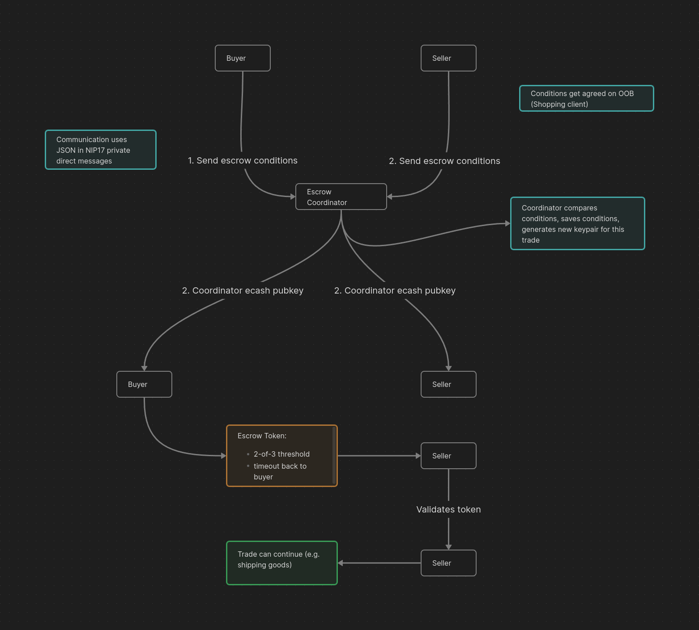

# Ecash escrow on Nostr concept

This project originated from the [Ecash Hackathon 2024](https://web.archive.org/web/20240527181133/https://www.nobsbitcoin.com/ecash-hackday-v2-to-take-place-in-berlin-on-june-20-21/).

## Idea
An escrow solution for trading projects (e.g. online shops) facilitating their payments over the [Cashu ecash protocol](https://cashu.space/). The trading parties can agree upon an escrow coordinator which is either hardcoded or can be discovered through a [Nostr](https://nostr.com/) announcement [event](https://github.com/nostr-protocol/nips/blob/master/01.md). How the escrow coordinator is chosen depends on the software implementing the client library (e.g. reputation based ranking).
Everyone can run an escrow coordinator and announce their service publicly trough Nostr.
The buying party locks its funds in a [2-of-3 P2PK ecash token](https://github.com/cashubtc/nuts/blob/main/11.md) which can then be unlocked by the buyer and seller (happy path) or the coordinator and one of the trading parties (escrow mediation path).

This makes it possible to separate away the escrow coordinator from the trading platform operator which can result in the following benefits for traders, developers and operators:

* Distributing trust between trading platform operator and escrow operator
* Reducing operational burden of running a trading platform
* Formation of an escrow coordinator market due to low entry barrier (driving down fees and favouring honest coordinators)
* Simple integration of escrow features in all kinds of trading platforms and applications
* No vendor lock-in to a single large escrow coordinator necessary
* Safer trading conditions in low trust environments (e.g. pseudonymous traders on nostr- or onion markets)
* Good privacy for traders in happy case (coordinator has few, ephemeral information about trade and traders)

## Protocol Overview

#### Additions and thoughts

##### Submitting escrow conditions
Both trading parties have to commit to their trade obligations to the coordinator. This commitment has to contain all information necessary for the coordinator to decide which trade party fulfilled their obligations in the case of an escrow mediation. This can include payout information, amounts, timeframes and a freely written trade contract. When possible, information can be submitted as hash to improve privacy against the coordinator.

##### Nostr communication
To reduce unnecessary burden on relays we can aim to use ephemeral event types for communication between traders and coordinator.

##### Client
The client could be distributed as wasm library and rust crate. There could also be a compilation flag that decides if the client gets built with nostr communication logic or only with nostr event creation logic. First would be useful for inclusion in traditional trading platforms and second would be useful for nostr based trading platforms already including relay/communication logic.

## Testing
The current `NostrClient` code only uses an in memory local test relay, which must be started before testing.

By now we use the relay at `git@github.com:rodant/bucket.git`. To start the relay locally:
1. Checkout the master branch from the repo above.
2. Run `yarn`, only needed the first time.
2. Start the relay with `yarn start`.

### Running the Demo
Before running the trader clients and the coordinator, start also a test mint using a fake funds source.

`docker run -p 3338:3338 --name nutshell -e MINT_BACKEND_BOLT11_SAT=FakeWallet -e MINT_LISTEN_HOST=0.0.0.0 -e MINT_LISTEN_PORT=3338 -e MINT_PRIVATE_KEY=TEST_PRIVATE_KEY cashubtc/nutshell:0.15.3 poetry run mint`

Alternatively you can checkout the `cachubtc/nutshell` repo from Github and run it locally, see the instructions for that in the README.md of that repo.

### Running the Unit Tests
Currently only the common package has some tests implemented.

To run the tests:
1. Start the local relay as explained above.
2. Then execute `cargo test.sh`.

Of course you can also run single tests as simple as `cargo test test_name`.

## Acknowledgments
Special thanks to the following projects, without them this project wouldn't be possible:

* [Cashu Development Kit](https://github.com/cashubtc/cdk)
* [Rust Nostr](https://github.com/rust-nostr/nostr)

## Contribution
If you want to discuss this project or contribute feel free to join the [SimpleX messenger group](https://simplex.chat/contact#/?v=2-5&smp=smp%3A%2F%2F6iIcWT_dF2zN_w5xzZEY7HI2Prbh3ldP07YTyDexPjE%3D%40smp10.simplex.im%2FXp-lzznxmQTAKO3yJQtx_Bu9j2ZxDmRS%23%2F%3Fv%3D1-2%26dh%3DMCowBQYDK2VuAyEATACuD83g5rq9Eooa7-tv0q1vff8HUs8ucJ0OgSJ36zQ%253D%26srv%3Drb2pbttocvnbrngnwziclp2f4ckjq65kebafws6g4hy22cdaiv5dwjqd.onion&data=%7B%22type%22%3A%22group%22%2C%22groupLinkId%22%3A%22Oe7Ff4nsqtAjx4sVV8rcDA%3D%3D%22%7D)

#### Pull requests
When submitting pull requests, please ensure your code is formatted using rustfmt to maintain consistent code style throughout the project.
